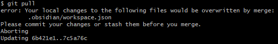

[Table of Contents](../README.md) | [Markdown Cheatsheet](/Markdown%20Cheatsheet.md)
___
## Cannot `git pull` because of override error:

Then you can run `git pull` to pull the repository and `git stash drop`to remove the old files:\
![[overwrite-error-solution.png]]
___
